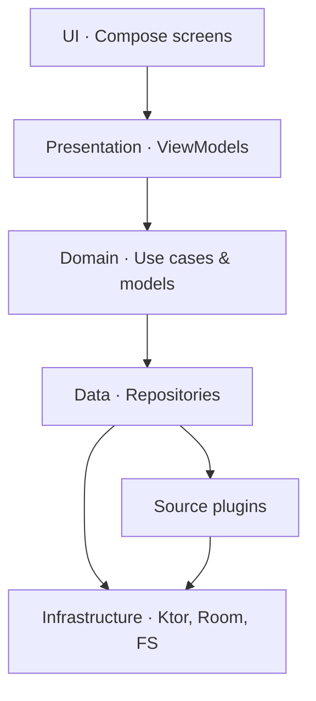

# Webnovel & Manhwa Reader — Architecture

A personal-use Android app that acts as a unified reader for webnovel and manhwa
sites. Each site is implemented as a **source plugin** behind a common
interface, so the rest of the app stays site-agnostic. UI is Jetpack Compose;
network layer is Ktor Client.

---

## 1. Tech stack

| Concern        | Choice                                                       |
| -------------- | ------------------------------------------------------------ |
| UI             | Jetpack Compose, Material 3                                  |
| Async          | Kotlin Coroutines + Flow                                     |
| HTTP           | Ktor Client (OkHttp engine)                                  |
| HTML parsing   | Jsoup                                                        |
| JSON           | kotlinx.serialization                                        |
| Database       | Room                                                         |
| Preferences    | Jetpack DataStore (Preferences)                              |
| Image loading  | Coil 3                                                       |
| Background     | WorkManager                                                  |
| DI             | Hilt (or Koin — pick one and stay)                           |
| Min SDK        | 26 (Android 8.0). Target latest stable.                      |
| JVM target     | 17                                                           |

---

## 2. Architecture overview

Six layers, top-down. Calls go down; data comes back up. Lower layers never
import from higher ones.

```
┌────────────────────────────────────────────────────────────┐
│  UI                  Compose screens (stateless)           │
├────────────────────────────────────────────────────────────┤
│  Presentation        ViewModels, UiState, StateFlow        │
├────────────────────────────────────────────────────────────┤
│  Domain              Use cases, pure-Kotlin models         │
├────────────────────────────────────────────────────────────┤
│  Data                Repositories (orchestration)          │
├────────────────────────────────────────────────────────────┤
│  Source plugins      Source interface + per-site impls     │
├────────────────────────────────────────────────────────────┤
│  Infrastructure      Ktor · Jsoup · Room · DataStore · FS  │
└────────────────────────────────────────────────────────────┘
```



### Key invariants

- The **domain layer has zero Android dependencies** — it must compile against
  plain JVM. No Compose, no Room, no Ktor types in domain models.
- Repositories are the **only** thing that talks to both `Source` plugins and
  local storage. ViewModels never touch a `Source` directly.
- The `Source` interface is the **only contract** between the data layer and
  the per-site implementations. Adding a new site = implementing one interface.
- Reader logic for novels and manhwa is **explicitly separate**. Don't try to
  unify the two readers; they share nothing structurally.

---

## 3. Core abstractions

### 3.1 Content type and chapter content

```kotlin
package com.opus.readerparser.domain.model

enum class ContentType { NOVEL, MANHWA }

/**
 * The two shapes a chapter can take. The reader screen branches on this once;
 * everything else in the stack stays content-type-agnostic.
 */
sealed interface ChapterContent {
    /** A novel chapter. HTML is sanitized but otherwise untouched. */
    data class Text(val html: String) : ChapterContent

    /** A manhwa chapter. Pages are HTTP URLs in reading order. */
    data class Pages(val imageUrls: List<String>) : ChapterContent
}
```

### 3.2 Domain models

Pure data classes. No Room annotations, no serialization annotations, no
Android types.

```kotlin
package com.opus.readerparser.domain.model

data class Series(
    val sourceId: Long,
    val url: String,                 // canonical URL on the source site = identity
    val title: String,
    val author: String? = null,
    val artist: String? = null,
    val description: String? = null,
    val coverUrl: String? = null,
    val genres: List<String> = emptyList(),
    val status: SeriesStatus = SeriesStatus.UNKNOWN,
    val type: ContentType,
)

enum class SeriesStatus { UNKNOWN, ONGOING, COMPLETED, HIATUS, CANCELLED }

data class Chapter(
    val seriesUrl: String,           // FK to Series.url
    val sourceId: Long,
    val url: String,                 // identity within (sourceId, seriesUrl)
    val name: String,
    val number: Float,               // -1f if not parseable from the site
    val uploadDate: Long? = null,    // epoch ms; null if unknown
)

data class SeriesPage(
    val series: List<Series>,
    val hasNextPage: Boolean,
)

data class FilterList(val filters: List<Filter> = emptyList())
sealed interface Filter {
    data class Text(val key: String, val value: String) : Filter
    data class Select(val key: String, val value: String) : Filter
    data class Toggle(val key: String, val value: Boolean) : Filter
}
```

### 3.3 The `Source` interface

This is the most important interface in the codebase. Every site plugin
implements it. Repositories depend on it; nothing depends on concrete sources.

```kotlin
package com.opus.readerparser.data.source

interface Source {
    val id: Long              // stable hash, used as FK in DB
    val name: String          // user-visible
    val lang: String          // ISO 639-1
    val baseUrl: String
    val type: ContentType

    /** True if this source supports the given filter family at all. */
    fun supports(filter: Filter): Boolean = true

    suspend fun getPopular(page: Int): SeriesPage
    suspend fun getLatest(page: Int): SeriesPage
    suspend fun search(query: String, page: Int, filters: FilterList): SeriesPage

    /** Fill in any details not present in the listing (description, genres…). */
    suspend fun getSeriesDetails(series: Series): Series

    suspend fun getChapterList(series: Series): List<Chapter>

    suspend fun getChapterContent(chapter: Chapter): ChapterContent
}
```

#### Source ID convention

```kotlin
fun computeSourceId(name: String, lang: String, type: ContentType): Long =
    "$name/$lang/${type.name}".hashCode().toLong() and 0xFFFFFFFFL
```

Stable across reinstalls; used as a foreign key in Room.

---

## 4. The source plugin system

### 4.1 `HtmlSource` base class

Most sites are HTML. Provide a shared base class with Ktor + Jsoup wired up so
each concrete source only writes parsing logic.

```kotlin
package com.opus.readerparser.data.source

import io.ktor.client.HttpClient
import io.ktor.client.request.get
import io.ktor.client.statement.bodyAsText
import org.jsoup.Jsoup
import org.jsoup.nodes.Document
import org.jsoup.nodes.Element

abstract class HtmlSource(
    protected val client: HttpClient,
) : Source {

    protected suspend fun fetchDoc(url: String): Document =
        Jsoup.parse(client.get(url).bodyAsText(), url)

    // ---- Concrete sources override these ----
    protected abstract fun popularUrl(page: Int): String
    protected abstract fun popularSelector(): String
    protected abstract fun seriesFromElement(el: Element): Series
    protected abstract fun popularNextPageSelector(): String?

    protected abstract fun searchUrl(query: String, page: Int, filters: FilterList): String
    protected open fun searchSelector(): String = popularSelector()
    protected open fun searchSeriesFromElement(el: Element): Series = seriesFromElement(el)
    protected open fun searchNextPageSelector(): String? = popularNextPageSelector()

    protected abstract fun seriesDetailsParse(doc: Document, series: Series): Series

    protected abstract fun chapterListSelector(): String
    protected abstract fun chapterFromElement(el: Element, series: Series): Chapter

    /** For novels: extract the chapter HTML body. For manhwa: not used. */
    protected open fun chapterTextParse(doc: Document): String =
        error("Override for novel sources")

    /** For manhwa: extract page image URLs in reading order. For novels: not used. */
    protected open fun chapterPagesParse(doc: Document): List<String> =
        error("Override for manhwa sources")

    // ---- Default Source implementations ----
    override suspend fun getPopular(page: Int): SeriesPage {
        val doc = fetchDoc(popularUrl(page))
        val series = doc.select(popularSelector()).map(::seriesFromElement)
        val next = popularNextPageSelector()?.let { doc.selectFirst(it) != null } ?: false
        return SeriesPage(series, next)
    }

    override suspend fun search(query: String, page: Int, filters: FilterList): SeriesPage {
        val doc = fetchDoc(searchUrl(query, page, filters))
        val series = doc.select(searchSelector()).map(::searchSeriesFromElement)
        val next = searchNextPageSelector()?.let { doc.selectFirst(it) != null } ?: false
        return SeriesPage(series, next)
    }

    override suspend fun getSeriesDetails(series: Series): Series =
        seriesDetailsParse(fetchDoc(series.url), series)

    override suspend fun getChapterList(series: Series): List<Chapter> =
        fetchDoc(series.url).select(chapterListSelector())
            .map { chapterFromElement(it, series) }

    override suspend fun getChapterContent(chapter: Chapter): ChapterContent {
        val doc = fetchDoc(chapter.url)
        return when (type) {
            ContentType.NOVEL  -> ChapterContent.Text(chapterTextParse(doc))
            ContentType.MANHWA -> ChapterContent.Pages(chapterPagesParse(doc))
        }
    }
}
```

### 4.2 Worked example — a manhwa source

```kotlin
package com.opus.readerparser.sources.examplemanhwa

class ExampleManhwa(client: HttpClient) : HtmlSource(client) {
    override val id = computeSourceId("ExampleManhwa", "en", ContentType.MANHWA)
    override val name = "ExampleManhwa"
    override val lang = "en"
    override val baseUrl = "https://example-manhwa.invalid"
    override val type = ContentType.MANHWA

    override fun popularUrl(page: Int) = "$baseUrl/popular?page=$page"
    override fun popularSelector() = "div.series-card"
    override fun popularNextPageSelector() = "a.next-page"

    override fun seriesFromElement(el: Element) = Series(
        sourceId = id,
        url      = el.selectFirst("a")!!.absUrl("href"),
        title    = el.selectFirst("h3")!!.text(),
        coverUrl = el.selectFirst("img")?.absUrl("src"),
        type     = type,
    )

    override fun searchUrl(query: String, page: Int, filters: FilterList) =
        "$baseUrl/search?q=${query.encodeURLParameter()}&page=$page"

    override fun seriesDetailsParse(doc: Document, series: Series) = series.copy(
        author      = doc.selectFirst(".author")?.text(),
        description = doc.selectFirst(".synopsis")?.text(),
        genres      = doc.select(".genres a").map { it.text() },
        status      = parseStatus(doc.selectFirst(".status")?.text()),
    )

    override fun chapterListSelector() = "ul.chapter-list li"

    override fun chapterFromElement(el: Element, series: Series): Chapter {
        val a = el.selectFirst("a")!!
        val name = a.text()
        return Chapter(
            seriesUrl  = series.url,
            sourceId   = id,
            url        = a.absUrl("href"),
            name       = name,
            number     = Regex("""Chapter\s+(\d+(?:\.\d+)?)""")
                            .find(name)?.groupValues?.get(1)?.toFloatOrNull() ?: -1f,
            uploadDate = parseDate(el.selectFirst(".date")?.text()),
        )
    }

    override fun chapterPagesParse(doc: Document): List<String> =
        doc.select("div.reader img").map { it.absUrl("src") }
}
```

A novel source looks identical except it overrides `chapterTextParse(doc)`
instead of `chapterPagesParse(doc)`, and its `type` is `NOVEL`.

### 4.3 `SourceRegistry`

Compile-time list of sources. Loaded once at app start by Hilt.

```kotlin
package com.opus.readerparser.data.source

class SourceRegistry(private val sources: Map<Long, Source>) {
    operator fun get(id: Long): Source =
        sources[id] ?: error("No source registered with id=$id")

    fun all(): List<Source> = sources.values.sortedBy { it.name }
}
```

```kotlin
@Module
@InstallIn(SingletonComponent::class)
object SourceModule {
    @Provides @Singleton
    fun registry(client: HttpClient): SourceRegistry = SourceRegistry(
        listOf(
            ExampleManhwa(client),
            ExampleNovel(client),
            // Add new sources here.
        ).associateBy { it.id }
    )
}
```

> If you ever want hot-loadable extensions like Tachiyomi, swap this for a
> `PackageManager`-based loader. Don't do that on day one.

---

## 5. Data layer

### 5.1 Repository contracts

```kotlin
interface SeriesRepository {
    /** Reactive list of all library entries. */
    fun observeLibrary(): Flow<List<Series>>

    /** Network-backed listing for a source's browse screen. */
    suspend fun fetchPopular(sourceId: Long, page: Int): SeriesPage
    suspend fun fetchLatest(sourceId: Long, page: Int): SeriesPage
    suspend fun search(sourceId: Long, query: String, page: Int, filters: FilterList): SeriesPage

    /** Fills in details and persists if in library. */
    suspend fun refreshDetails(series: Series): Series

    suspend fun addToLibrary(series: Series)
    suspend fun removeFromLibrary(series: Series)
}

interface ChapterRepository {
    fun observeChapters(series: Series): Flow<List<ChapterWithState>>
    suspend fun refreshChapters(series: Series)

    /** Returns local copy if downloaded, otherwise fetches from source. */
    suspend fun getContent(chapter: Chapter): ChapterContent

    suspend fun markRead(chapter: Chapter, read: Boolean)
    suspend fun setProgress(chapter: Chapter, progress: Float)  // 0f..1f
}

data class ChapterWithState(
    val chapter: Chapter,
    val read: Boolean,
    val downloaded: Boolean,
    val progress: Float,
)
```

### 5.2 Implementation pattern

```kotlin
class ChapterRepositoryImpl @Inject constructor(
    private val registry: SourceRegistry,
    private val dao: ChapterDao,
    private val downloads: DownloadStore,
) : ChapterRepository {

    override suspend fun getContent(chapter: Chapter): ChapterContent {
        downloads.read(chapter)?.let { return it }
        return registry[chapter.sourceId].getChapterContent(chapter)
    }

    override suspend fun refreshChapters(series: Series) {
        val remote = registry[series.sourceId].getChapterList(series)
        dao.upsertAll(remote.map { it.toEntity() })
    }
    // ...
}
```

Repositories are the **only** place that calls both `SourceRegistry` and
storage. Domain code never sees Ktor or Room.

---

## 6. Local storage

### 6.1 Room schema

```kotlin
@Entity(
    tableName = "series",
    primaryKeys = ["sourceId", "url"],
)
data class SeriesEntity(
    val sourceId: Long,
    val url: String,
    val title: String,
    val author: String?,
    val description: String?,
    val coverUrl: String?,
    val genresJson: String,        // JSON-encoded List<String>
    val status: String,
    val type: String,              // "NOVEL" | "MANHWA"
    val inLibrary: Boolean = false,
    val addedAt: Long? = null,
)

@Entity(
    tableName = "chapters",
    primaryKeys = ["sourceId", "url"],
    foreignKeys = [ForeignKey(
        entity = SeriesEntity::class,
        parentColumns = ["sourceId", "url"],
        childColumns  = ["sourceId", "seriesUrl"],
        onDelete = ForeignKey.CASCADE,
    )],
    indices = [Index("sourceId", "seriesUrl")],
)
data class ChapterEntity(
    val sourceId: Long,
    val url: String,
    val seriesUrl: String,
    val name: String,
    val number: Float,
    val uploadDate: Long?,
    val read: Boolean = false,
    val progress: Float = 0f,
    val downloaded: Boolean = false,
)

@Entity(tableName = "download_queue", primaryKeys = ["sourceId", "chapterUrl"])
data class DownloadQueueEntity(
    val sourceId: Long,
    val chapterUrl: String,
    val state: String,             // QUEUED | RUNNING | COMPLETED | FAILED
    val progress: Float = 0f,
    val errorMessage: String? = null,
)
```

Migrations: write them from day one; never use `fallbackToDestructiveMigration`
in release builds.

### 6.2 File system layout

App-private storage. Clean uninstall, no `MANAGE_EXTERNAL_STORAGE` needed.

```
filesDir/downloads/
  {sourceId}/
    {seriesUrlHash}/
      {chapterUrlHash}/
        meta.json          # { type, originalUrls[], pageCount, downloadedAt }
        content.html       # NOVEL only
        001.jpg            # MANHWA only — zero-padded, 3-digit
        002.jpg
        ...
```

Hashes are SHA-1 truncated to 16 hex chars, of the absolute URL. Stable across
runs; safe as filenames.

### 6.3 Preferences (DataStore)

One `Preferences` DataStore for app-wide settings:

- `theme` — system / light / dark
- `defaultReader.novel.fontSize` — sp
- `defaultReader.novel.fontFamily`
- `defaultReader.manhwa.layout` — `paged_ltr` / `paged_rtl` / `webtoon`
- `defaultReader.manhwa.zoom` — `fit_width` / `fit_height` / `original`
- `library.sortBy`, `library.filter.unreadOnly`, etc.

---

## 7. Downloads

WorkManager. One worker per chapter. Survives process death; retried with
exponential backoff.

```kotlin
@HiltWorker
class ChapterDownloadWorker @AssistedInject constructor(
    @Assisted ctx: Context,
    @Assisted params: WorkerParameters,
    private val registry: SourceRegistry,
    private val downloads: DownloadStore,
    private val dao: ChapterDao,
    private val client: HttpClient,
) : CoroutineWorker(ctx, params) {

    override suspend fun doWork(): Result = try {
        val sourceId   = inputData.getLong("sourceId", -1)
        val chapterUrl = inputData.getString("chapterUrl")!!
        val chapter    = dao.find(sourceId, chapterUrl)?.toDomain()
            ?: return Result.failure()

        when (val content = registry[sourceId].getChapterContent(chapter)) {
            is ChapterContent.Text  -> downloads.writeNovel(chapter, content.html)
            is ChapterContent.Pages -> downloads.writeManhwa(chapter, content.imageUrls) { url ->
                client.get(url).bodyAsChannel().toByteArray()
            }
        }
        dao.markDownloaded(sourceId, chapterUrl, true)
        Result.success()
    } catch (e: Exception) {
        if (runAttemptCount < 3) Result.retry() else Result.failure()
    }
}
```

Enqueue with `OneTimeWorkRequest` + a tag like `"download-${sourceId}-${chapterHash}"`
so duplicates can be queried/cancelled.

---

## 8. UI layer

### 8.1 Screens

| Screen           | Purpose                                                   |
| ---------------- | --------------------------------------------------------- |
| `LibraryScreen`  | Grid of saved series. Filter, sort, search inline.        |
| `BrowseScreen`   | Source-picker → popular/latest/search within a source.    |
| `SeriesScreen`   | Series detail + chapter list.                             |
| `NovelReader`    | Vertical text reader (novels only).                       |
| `MangaReader`    | Pager / webtoon image reader (manhwa only).               |
| `DownloadsScreen`| Download queue with progress + retry.                     |
| `SettingsScreen` | App-wide prefs.                                           |

### 8.2 ViewModel pattern

```kotlin
@HiltViewModel
class SeriesViewModel @Inject constructor(
    savedState: SavedStateHandle,
    private val seriesRepo: SeriesRepository,
    private val chapterRepo: ChapterRepository,
) : ViewModel() {

    private val seriesUrl: String = savedState["seriesUrl"]!!
    private val sourceId: Long    = savedState["sourceId"]!!

    private val _state = MutableStateFlow(SeriesUiState())
    val state: StateFlow<SeriesUiState> = _state.asStateFlow()

    private val _effects = Channel<SeriesEffect>(Channel.BUFFERED)
    val effects: Flow<SeriesEffect> = _effects.receiveAsFlow()

    init { observe(); refresh() }

    fun onAction(action: SeriesAction) { /* ... */ }
    // ...
}

data class SeriesUiState(
    val series: Series? = null,
    val chapters: List<ChapterWithState> = emptyList(),
    val isLoading: Boolean = false,
    val error: String? = null,
)

sealed interface SeriesAction {
    data object Refresh : SeriesAction
    data class OpenChapter(val chapter: Chapter) : SeriesAction
    data class ToggleLibrary(val inLibrary: Boolean) : SeriesAction
}

sealed interface SeriesEffect {
    data class NavigateToReader(val chapter: Chapter) : SeriesEffect
    data class ShowError(val message: String) : SeriesEffect
}
```

### 8.3 Compose conventions

- One `*Screen` composable per screen, takes a `ViewModel = hiltViewModel()`
  and immediately delegates to a stateless `*Content(state, onAction)`.
  Previews target `*Content`, not `*Screen`.
- Collect state with `collectAsStateWithLifecycle()`. Never `collectAsState`.
- Side effects (navigation, snackbars) come from a `Channel`, collected with
  `LaunchedEffect(Unit) { vm.effects.collect { … } }`.
- Hoist anything reused (cover image, chapter row, status pill) into its own
  stateless composable in `ui/components/`.

---

## 9. Reader implementation

The novel and manhwa readers are **separate screens**. They are reached from
the same `OpenChapter` action; the navigation graph dispatches based on
`Series.type`.

### 9.1 Novel reader

- Vertical scrolling.
- Render `ChapterContent.Text.html` either by:
  - Sanitizing → converting to `AnnotatedString` (preferred, Compose-native), or
  - Embedding a `WebView` with custom CSS for theming (pragmatic).
- Settings: font size, font family, line height, theme (light/sepia/dark),
  alignment.
- Persist scroll position as `progress: Float` in `ChapterEntity` on dispose.
- Tap zones: top = open settings sheet, middle = toggle chrome, bottom = next
  chapter.

### 9.2 Manhwa reader

- Two layouts, user-selectable:
  - **Paged** (LTR / RTL) — `HorizontalPager` over pages.
  - **Webtoon** — `LazyColumn` of full-bleed images.
- Image loading via Coil. Preload the next 2–3 pages.
- Pinch-to-zoom and pan via `Modifier.transformable` + `graphicsLayer`. Reset
  zoom on page change in paged mode.
- Long-press a page → save image / share.
- Track progress as current page index (paged) or scroll fraction (webtoon).

### 9.3 Reader navigation

```
Reader/{seriesUrl}/{chapterUrl}/{type}
  ├── if type == NOVEL  → NovelReaderScreen
  └── if type == MANHWA → MangaReaderScreen
```

Both readers expose the same nav actions: previous chapter, next chapter,
chapter list. Implement these as a small `ReaderViewModel` shared shape with
type-specific content state.

---

## 10. Module / package structure

Single Gradle module to start. Split when build times hurt.

```
app/src/main/kotlin/com/opus/readerparser/
├── ui/
│   ├── library/        LibraryScreen, LibraryViewModel, LibraryUiState
│   ├── browse/         BrowseScreen, SourceListScreen
│   ├── series/         SeriesScreen, SeriesViewModel
│   ├── reader/
│   │   ├── novel/      NovelReaderScreen, NovelReaderViewModel
│   │   └── manhwa/     MangaReaderScreen, MangaReaderViewModel
│   ├── downloads/      DownloadsScreen
│   ├── settings/       SettingsScreen
│   ├── components/     Cover, ChapterRow, StatusPill, ErrorState
│   ├── navigation/     NavGraph, Destinations
│   └── theme/          Color, Type, Theme
├── domain/
│   ├── model/          Series, Chapter, ChapterContent, ContentType, ...
│   └── usecase/        Cross-repo operations (sparingly)
├── data/
│   ├── repository/     SeriesRepositoryImpl, ChapterRepositoryImpl
│   ├── local/
│   │   ├── database/   AppDatabase, DAOs, entities, migrations, mappers
│   │   ├── filesystem/ DownloadStore, paths
│   │   └── prefs/      SettingsStore (DataStore)
│   ├── source/         Source interface, HtmlSource, SourceRegistry
│   └── network/        Ktor client config, JSON, cookie jar
├── sources/            One file per site
│   ├── examplemanhwa/ExampleManhwa.kt
│   ├── examplenovel/ExampleNovel.kt
│   └── ...
├── workers/            ChapterDownloadWorker, LibraryUpdateWorker
├── core/
│   ├── di/             Hilt modules
│   ├── result/         Result types, error mapping
│   └── util/           extensions, hashing, dates
└── App.kt              @HiltAndroidApp
```

When you outgrow this, split as:
`:core`, `:domain`, `:data`, `:sources:<site>`, `:feature:<screen>`, `:app`.

---

## 11. Network layer

```kotlin
@Module
@InstallIn(SingletonComponent::class)
object NetworkModule {
    @Provides @Singleton
    fun client(@ApplicationContext ctx: Context): HttpClient = HttpClient(OkHttp) {
        engine {
            config {
                connectTimeout(15, TimeUnit.SECONDS)
                readTimeout(30, TimeUnit.SECONDS)
                followRedirects(true)
                cookieJar(PersistentCookieJar(ctx))
                cache(Cache(File(ctx.cacheDir, "http"), 50L * 1024 * 1024))
            }
        }
        install(ContentNegotiation) { json(Json { ignoreUnknownKeys = true }) }
        install(HttpRequestRetry) { retryOnServerErrors(maxRetries = 2); exponentialDelay() }
        install(UserAgent) { agent = "ReaderApp/1.0 (personal)" }
        install(HttpTimeout) { requestTimeoutMillis = 30_000 }
    }
}
```

Per-source overrides (custom headers, login, rate-limiting) belong inside
that source's class — wrap the shared client with a request interceptor or
build a per-source `HttpClient` that forks the shared engine.

---

## 12. Dependencies

Live version catalog: `gradle/libs.versions.toml`. The block below is the
current snapshot, kept in sync with the working build.

```toml
[versions]
agp = "9.1.1"
kotlin = "2.1.20"
ksp = "2.1.20-1.0.31"
compose-bom = "2024.10.00"
lifecycle = "2.8.7"
coroutines = "1.9.0"
ktor = "3.0.1"
serialization = "1.7.3"
jsoup = "1.18.1"
room = "2.6.1"
datastore = "1.1.1"
coil = "3.0.4"
work = "2.10.0"
hilt = "2.59"
hilt-work = "1.2.0"
navigation-compose = "2.8.4"
activity-compose = "1.9.3"
coreKtx = "1.15.0"
junit = "4.13.2"
junitVersion = "1.1.5"
espressoCore = "3.5.1"

[libraries]
androidx-core-ktx = { module = "androidx.core:core-ktx", version.ref = "coreKtx" }
androidx-lifecycle-runtime = { module = "androidx.lifecycle:lifecycle-runtime-ktx", version.ref = "lifecycle" }
androidx-lifecycle-viewmodel = { module = "androidx.lifecycle:lifecycle-viewmodel-compose", version.ref = "lifecycle" }
androidx-activity-compose = { module = "androidx.activity:activity-compose", version.ref = "activity-compose" }

compose-bom = { module = "androidx.compose:compose-bom", version.ref = "compose-bom" }
compose-ui = { module = "androidx.compose.ui:ui" }
compose-ui-tooling = { module = "androidx.compose.ui:ui-tooling" }
compose-ui-tooling-preview = { module = "androidx.compose.ui:ui-tooling-preview" }
compose-ui-test-manifest = { module = "androidx.compose.ui:ui-test-manifest" }
compose-material3 = { module = "androidx.compose.material3:material3" }
compose-navigation = { module = "androidx.navigation:navigation-compose", version.ref = "navigation-compose" }

ktor-client-core = { module = "io.ktor:ktor-client-core", version.ref = "ktor" }
ktor-client-okhttp = { module = "io.ktor:ktor-client-okhttp", version.ref = "ktor" }
ktor-client-content-negotiation = { module = "io.ktor:ktor-client-content-negotiation", version.ref = "ktor" }
ktor-serialization-json = { module = "io.ktor:ktor-serialization-kotlinx-json", version.ref = "ktor" }

kotlinx-serialization-json = { module = "org.jetbrains.kotlinx:kotlinx-serialization-json", version.ref = "serialization" }
kotlinx-coroutines-android = { module = "org.jetbrains.kotlinx:kotlinx-coroutines-android", version.ref = "coroutines" }

jsoup = { module = "org.jsoup:jsoup", version.ref = "jsoup" }

room-runtime = { module = "androidx.room:room-runtime", version.ref = "room" }
room-ktx = { module = "androidx.room:room-ktx", version.ref = "room" }
room-compiler = { module = "androidx.room:room-compiler", version.ref = "room" }

datastore-preferences = { module = "androidx.datastore:datastore-preferences", version.ref = "datastore" }

coil-compose = { module = "io.coil-kt.coil3:coil-compose", version.ref = "coil" }
coil-network-okhttp = { module = "io.coil-kt.coil3:coil-network-okhttp", version.ref = "coil" }

work-runtime = { module = "androidx.work:work-runtime-ktx", version.ref = "work" }

hilt-android = { module = "com.google.dagger:hilt-android", version.ref = "hilt" }
hilt-compiler = { module = "com.google.dagger:hilt-compiler", version.ref = "hilt" }
hilt-work = { module = "androidx.hilt:hilt-work", version.ref = "hilt-work" }

junit = { module = "junit:junit", version.ref = "junit" }
androidx-junit = { module = "androidx.test.ext:junit", version.ref = "junitVersion" }
androidx-espresso-core = { module = "androidx.test.espresso:espresso-core", version.ref = "espressoCore" }

[plugins]
android-application = { id = "com.android.application", version.ref = "agp" }
kotlin-android = { id = "org.jetbrains.kotlin.android", version.ref = "kotlin" }
kotlin-compose = { id = "org.jetbrains.kotlin.plugin.compose", version.ref = "kotlin" }
ksp = { id = "com.google.devtools.ksp", version.ref = "ksp" }
hilt-android = { id = "com.google.dagger.hilt.android", version.ref = "hilt" }
```

> This file is the source of truth. The `[plugins]` section declares every
> plugin available to the project; not every module applies all of them.

---

## 13. Coding conventions

- **Domain models are immutable `data class`es.** No mutable state outside
  `MutableStateFlow` inside ViewModels and the DB.
- **No nullable booleans.** Use sealed types or non-null with a clear default.
- **No `runBlocking` in production code.** Tests only.
- **Errors propagate as exceptions inside repositories** and are caught in
  ViewModels, mapped to a domain `Failure` type, and surfaced via `UiState`.
- **One file per public type.** Sealed hierarchies and tightly-coupled helpers
  may live alongside.
- **Ktor calls always live behind a `Source` or `*Repository`.** No raw
  `client.get(...)` in ViewModels or composables, ever.
- **Sources never log.** They throw. Logging is the repository's job.
- **Tests:** repositories with fakes for `Source` + DAO; sources with canned
  HTML fixtures and a `MockEngine`-backed `HttpClient`; ViewModels with fakes
  for repositories; UI with Compose UI tests on `*Content` composables.

---

## 14. Build order

A sensible week-by-week if building solo:

1. Project skeleton, DI, theme, navigation, empty screens.
2. Network layer + `Source` + `HtmlSource` + one manhwa source end-to-end
   (browse → details → chapter list → manhwa reader, no persistence).
3. Room schema, library + reading-progress persistence.
4. Novel source + novel reader.
5. Downloads (WorkManager) + downloaded-chapter playback.
6. Library updates (background refresh of new chapters).
7. Polish: settings, filters, search history, error states.
